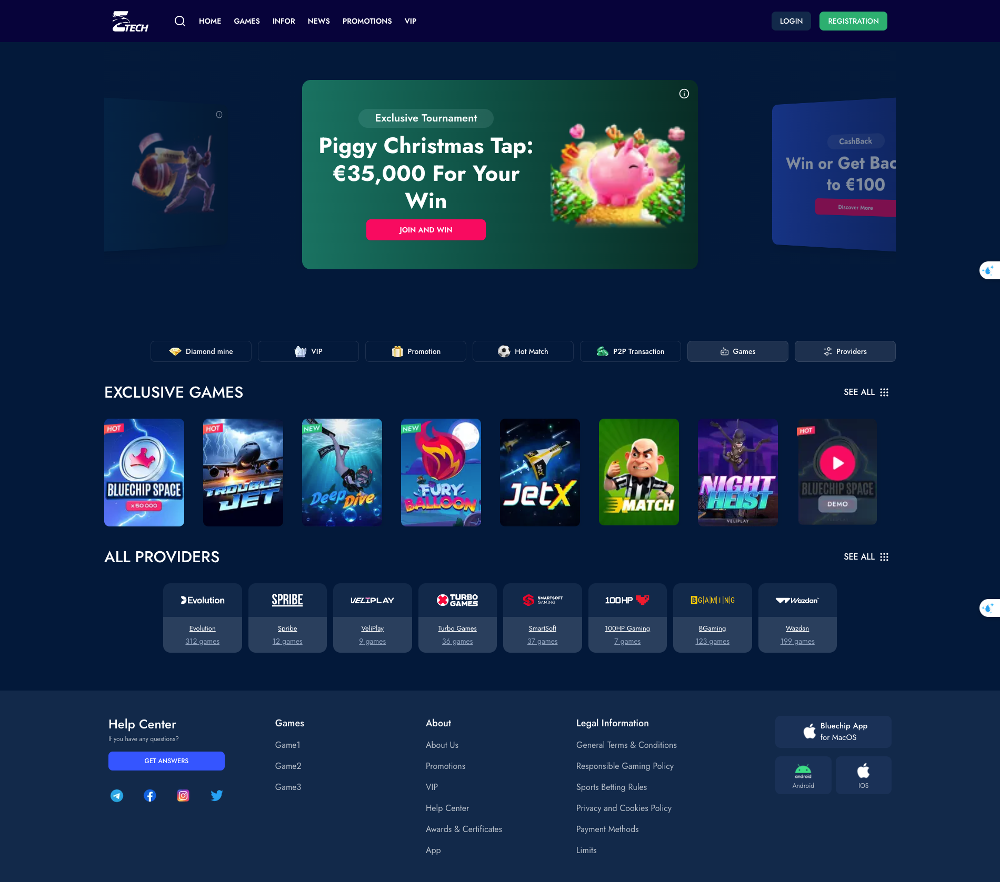

## Project Technology Summary

### Core Technologies
- **Next.js 15.2.2** - React framework for production-grade applications
- **React 19** - JavaScript library for building user interfaces
- **TypeScript** - Typed JavaScript for better developer experience

### UI and Styling
- **Tailwind CSS 4** - Utility-first CSS framework
- **Shadcn** - Unstyled, accessible component library

### Development Tools
- **ESLint** - Code linting
- **TypeScript** - Static type checking
- **Turbopack** - Next.js bundler for faster development

### Website URL: https://nevel-tech-test-ebon.vercel.app

### Desktop Screen

### Mobile Screen

